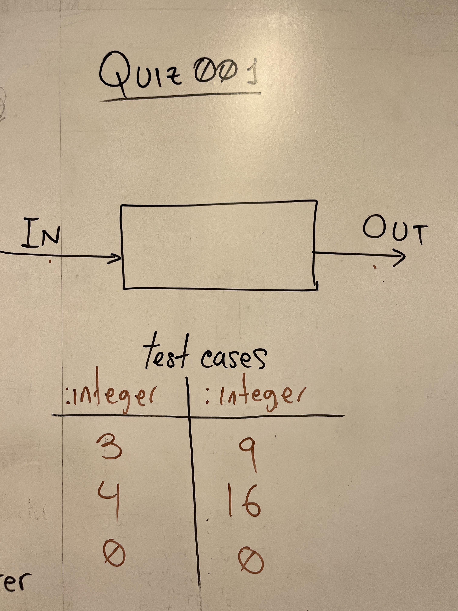

# Solution to quiz001

**Fig. 1** This is the solution to the black box

**Fig. 1** shows my solution to the quiz001. The procedure to generate
the outputs below are

| input                        | output          |
|------------------------------|-----------------|
| international                | i11l            |
| (cats) + (dogs) = (troubles) | (4) + (4) = (8) |
|                              |                 |
